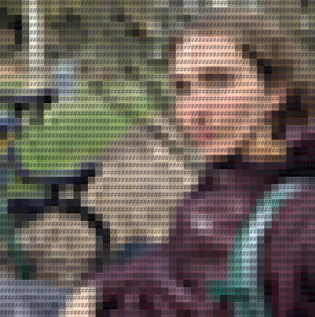

  

<h3 align="center">Personal Site</h3>
<h5 align="center">For CS510 - Intro to Web Development, Summer 2022</h5>

---

## 📝 Table of Contents

- [About](#about)
- [Prerequisites](#prereqs)
- [Built Using](#built-using)
- [Authors](#authors)
- [Acknowledgments](#acknowledgement)

## 🧐 About 

A single-page site designed to showcase my previous experience and projects. It's also a project in its own right; it should showcase what I know about front end design as of the end of the intro class for which it was produced. As I continue to grow in my ongoing education and career pursuits this site should serve as my expanded business card.

The site is rebuilt and deployed automatically for each push to the main branch.

## 🏁 Prerequisites 

All you need is a relatively modern browser and an internet connection. The site is designed to respond fluidly to changes in screen size and should be usable and pleasant to look at for any reasonable resolution or aspect ratio, though some niche devices may not have been taken into consideration. The site is viewable at https://seahorse-app-989ub.ondigitalocean.app/ for the time being, but it will eventually get its own domain name.

The site should be accessible to most people regardless of disabilities - if you're not able to easily navigate the site then I've missed something and it would be hugely appreciated if you could reach out to me via Github and/or create an issue on the project's repository.

## ⛏️ Built Using 

- [JQuery](https://jquery.com/) - Powerful library for querying and manipulating DOM nodes
- [Bootstrap 4](https://getbootstrap.com/docs/4.2/getting-started/introduction/) - CSS framework
- [EmailJS](https://www.emailjs.com/) - Free and simple contact-form-to-email API
- [Digital Ocean](https://www.digitalocean.com/) - Free static site hosting and serving
- [Favicon.io](https://favicon.io/) - Generate various sized favicons from a PNG
- [StackOverflow](https://www.stackoverflow.com/) - Everything else

## ✍️ Authors 

- [Amelia Miner (@amminer)](https://github.com/amminer)

## 🎉 Acknowledgements 

- Many thanks to [Caterina (@CaterinasWorld)](https://github.com/caterinasworld) for running an engaging remote course with great material.

- Hat tip to the following resources in particular for providing platforms or tutorials for problems this project necessitated solving:
  - [How to collapse a hamburger menu on mobile (Bootstrap Studio)](https://forum.bootstrapstudio.io/t/how-to-get-a-website-menu-to-collapse-after-selection-on-mobile/3792/6)
  - [How to force the body of a page to occupy the entire width on mobile (Stack Overflow)](https://stackoverflow.com/questions/30358630/html-body-not-filling-complete-width-on-mobile-devices)
  - [How to prevent the nav bar from covering page content on navigation (Stack Overflow)](https://stackoverflow.com/questions/17534661/make-anchor-link-go-some-pixels-above-where-its-linked-to)
